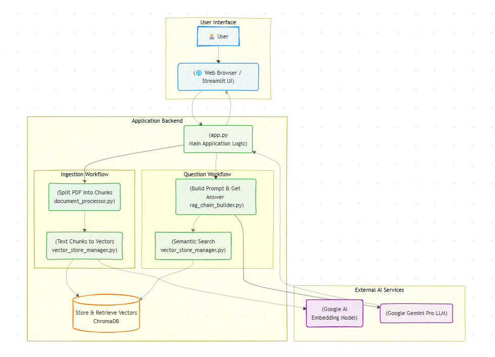

# AI-Powered Course Companion: A RAG-Based Tutoring Application

Welcome to the repository for my AI-Powered Course Companion, a project conceived and executed as a cornerstone of my journey into AI and Machine Learning engineering. This application is a fully-functional, Retrieval-Augmented Generation (RAG) system that transforms dense technical documents into an interactive and personalized learning experience.

This project was built to demonstrate a deep, practical understanding of modern AI development workflows, from data ingestion and vector storage to advanced LLM orchestration with multi-step chains.

The application allows a user to:
1.  **📚 Create & Manage Subjects:** Organize learning materials into distinct, isolated subjects (e.g., "Thermodynamics," "Fluid Mechanics").
2.  **🧠 Ingest Knowledge:** Upload personal PDF documents (notes, textbook chapters) into a specific subject, where they are processed and stored for retrieval.
3.  **💬 Get Personalized Tutoring:** Interact with a conversational AI that can answer questions, summarize complex topics, and even generate quizzes based *exclusively* on the provided documents.

---

## 🚀 Live Application & Video Demonstration

This project is designed to be run locally, showcasing a complete full-stack Python application. The following short, animated GIF demonstrates the application's core workflow: creating a subject, uploading a PDF, and asking the AI a specific question based on the document's content.


---

## 🏛️ Architectural Philosophy & Design

This application was architected with three core principles in mind: **Modularity, Data-Centric Design, and User Experience.** It employs a self-contained, full-stack Python architecture where a user-friendly frontend built with Streamlit interacts with a robust backend logic system powered by LangChain. This design ensures a clean separation of concerns and a seamless flow of data from raw documents to intelligent insights.

### High-Level Logical Flow

The diagram below illustrates the application's data pipeline, showing how a user's question is grounded in specific, relevant information before being answered by the AI.



---

## 💡 Key Features & Technical Decisions

This project is a demonstration of solving a practical problem—mastering technical information—with a modern AI engineering stack.

### 1. End-to-End Subject-Specific RAG Pipeline
The core of the application is a complete, from-scratch RAG system that ensures the AI's responses are accurate and grounded in fact.

-   **Data Ingestion & Processing:** Uses `PyPDFLoader` to extract text and `RecursiveCharacterTextSplitter` to intelligently chunk documents, a crucial step for effective retrieval.
-   **Vectorization with Google Models:** Leverages `GoogleGenerativeAIEmbeddings` to convert text chunks into high-dimensional vectors, capturing their semantic meaning.
-   **Local-First Vector Storage:** Implements `ChromaDB` as the vector store. This decision allows for a fully local, fast, and cost-effective solution for managing and querying document embeddings on a per-subject basis.

### 2. Advanced, Multi-Task LLM Orchestration
This project goes beyond simple Q&A by using LangChain to build and manage multiple, specialized AI chains, demonstrating an understanding of prompt engineering and modular AI design.

-   **Context-Aware Q&A Chain:** The primary chain that takes a user's question, retrieves relevant document chunks from ChromaDB, and passes them to the Gemini model to generate a fact-based answer.
-   **Specialized Chains for Learning:** Includes distinct chains for other critical learning tasks:
    -   **Summarization:** To provide concise overviews of complex topics.
    -   **Concept Comparison:** To compare and contrast ideas based on the provided texts.
    -   **Quiz Generation:** To create multiple-choice questions for self-assessment.

### 3. Interactive & User-Friendly Frontend
The application is built with a focus on user experience, using a modern Python framework for rapid, data-centric development.

-   **Rapid UI with Streamlit:** Streamlit was chosen to allow for the creation of a polished, interactive web UI entirely in Python, demonstrating the ability to build and present a finished product without needing a separate frontend team or language.
-   **Robust State Management:** The application correctly uses `st.session_state` to manage user sessions, selected subjects, chat history, and the active vector store, ensuring a smooth and stateful user experience as they navigate between different subjects and features.

---

## 🧠 Learning Journey & Skill Demonstration

-   **From Theory to Practice:** This project is tangible proof of my ability to take theoretical AI concepts (RAG, LLMs, prompt engineering) and implement them in a real, working application.
-   **Full-Stack Python Proficiency:** It demonstrates the ability to build a complete, end-to-end application using only the Python ecosystem—from backend logic and data processing to a polished, interactive frontend.
-   **Mastery of Modern AI Tooling:** It showcases hands-on expertise with the most relevant libraries in the Generative AI space: **LangChain** for orchestration and **Google Gemini** for the core intelligence.
-   **Leveraging Domain Expertise:** The project's very nature—a tool to master dense technical documents—is a direct application of AI to solve a real problem I understand deeply from my mechanical engineering background.

---

## 💻 Technology Stack

This project leverages a modern, Python-centric technology stack to deliver a complete AI-powered learning tool.

| Category | Technology / Library | Purpose & Key Skills Demonstrated |
|:---|:---|:---|
| **Frontend & App Logic** | Streamlit | Rapid UI development, data-centric interactivity, session state management |
| **AI Orchestration** | LangChain | Building and managing complex LLM chains, prompt engineering, data connection |
| **AI Model** | Google Gemini (`gemini-pro`) | Core generative intelligence for Q&A, summarization, and quizzing |
| **Vector Database** | ChromaDB | Local-first vector storage, efficient semantic search, document retrieval |
| **Data Processing** | `pypdf`, `python-dotenv` | PDF text extraction, secure management of API keys |
| **Foundation** | Python 3.11+, Git | Core programming language, version control for professional development |

---

## ⚙️ Local Development Setup

This repository contains all the code needed to run the application locally. To get started, you will need **Python 3.11+**.

1.  **Clone the Repository:**
    ```bash
    git clone https://github.com/DawsonSallee/me-course-companion
    cd me-course-companion
    ```
2.  **Create and Activate a Virtual Environment:**
    ```bash
    python -m venv .venv
    source .venv/bin/activate  # On Windows: .\.venv\Scripts\activate
    ```
3.  **Install Dependencies:**
    ```bash
    pip install -r requirements.txt
    ```
4.  **Set Up Environment Variables:**
    - Create a file named `.env` in the project root.
    - Inside the `.env` file, add your Google API key: `GEMINI_API_KEY="YOUR_API_KEY"`
5.  **Run the Streamlit Application:**
    ```bash
    streamlit run app.py
    ```

The application will now be running and accessible in your web browser.
